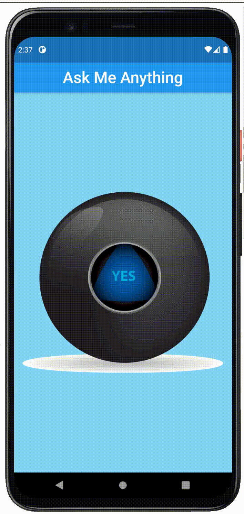

# magic_8_ball_flutter

This application is one of the challenges in The Complete 2020 Flutter Development Bootcamp with Dart.
It is a Magic 8 Ball app, which you can ask to answer all of your difficult life questions, such as
"I work or should I watch Netflix?"

This app has a whole bunch of random images and every time you tap on the Magic 8 Ball, it will give you a new answer.

## What I have learnt from this module

- How to use Flutter stateless widgets to design the user interface.
- How to use Flutter stateful widgets to update the user interface.
- How to change the properties of various widgets.
- How to use onPressed listeners to detect when buttons are pressed.
- How to use setState to mark the widget tree as dirty and requiring update on the next render.
- How to use Expanded to make widgets adapt to screen dimensions.
- Understand and use string interpolation.
- Learn about basic dart programming concepts such as data types and functions.
- Code and use gesture controls.

